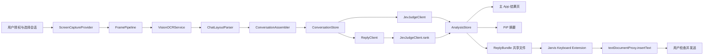

# Jarvis iOS 业务架构设计

> 文档状态：设计稿
>
> 资料核对日期：2026-09-22。系统版本、SDK 和库实现均为此次核对的快照，实施时需复核。
>
> 适用范围：`jev-chat-jarvis-ios`、本地 `Visyn` Swift Package，以及安卓参考项目 `jev-chat-jarvis`
>
> 当前实现只包含屏幕采集演示和画中画演示。本文件描述接入 BYOK、OCR、跨屏会话合并、语义分析和 Jarvis 自定义键盘后的目标架构，不代表这些能力已经完成。

## 1. 目标与平台边界

Jarvis iOS 的目标是：用户在聊天 App 中阅读消息时，授权 Jarvis 采集屏幕，识别当前会话，生成三条候选回复，并通过 Jarvis 键盘让用户选择一条插入当前输入框。消息最终仍由用户检查和发送。

安卓参考项目的实际链路是“无障碍节点采集或单次截图 OCR → 消息序列合并 → Jev 判断 → 回复生成与排序”。它不是连续录屏后拼接成长图。iOS 应继承消息模型和模型协议，重写采集、OCR、浮窗和文本填入部分。

### 1.1 可以实现的能力

- 通过 ReplayKit/Visyn（旧系统）或 ScreenCaptureKit（新系统）取得用户明确授权的屏幕帧。
- 使用 Apple Vision 在本地识别中文和英文文字。
- 根据文字块、位置、时间和重叠关系合并连续屏幕中的聊天消息。
- 使用三条独立的 BYOK 模型路线：Jev 判断、回复生成、可选的云视觉补充。
- 使用 Visyn PiP 显示只读的摘要、状态和一条推荐结果。
- 提供 Jarvis 自定义键盘，在键盘自身绘制三个候选按钮，点击后调用 `textDocumentProxy.insertText(_:)`。

### 1.2 不可按安卓方式实现的能力

- 不能通过公开 iOS API 读取微信、飞书等其他 App 的无障碍节点树。
- 不能可靠获得当前前台 App 的包名、联系人或聊天窗口标识。
- 不能替其他 App 自动滚动、点击发送按钮或调用类似 Android `ACTION_SET_TEXT` 的无障碍动作。
- 不能把候选回复写入 Apple 系统键盘或搜狗等其他输入法的 QuickType 候选栏。Jarvis 键盘只能自己绘制候选区。
- PiP 内容是视频像素，不是可交互的安卓式悬浮窗；候选选择和复制放在 Jarvis 键盘或主 App。

## 2. 当前工程事实

| 项目 | 当前情况 | 设计影响 |
|---|---|---|
| 主 App | `jev-chat-jarvis-ios/ViewController.swift` 只计数 `VisynCaptureController.onFrame` | 需要增加协调器、OCR、会话、模型和状态仓库 |
| 广播扩展 | `JarvisBroadcastExtension/SampleHandler.swift` 是空子类 | 第一版保持 Visyn 传输职责，业务不放在扩展中 |
| Visyn 帧 | 单槽、每约 0.3 秒最多一帧，长边 1280，JPEG 质量 0.7 | 是抽样帧，不是完整录像或可靠的滚动历史 |
| Visyn 接收 | `onFrame` 在主线程回调，消费后删除共享帧 | 回调必须立即交给后台有界流水线，键盘不能读取该邮箱 |
| PiP | UIView 被光栅化为约 828×160 的视频帧，内容不可点击 | PiP 只放短摘要和状态 |
| 共享能力 | 主 App 和广播扩展已有 App Group | 可增加独立的键盘共享结果文件 |
| 密钥 | iOS 尚未实现；安卓参考使用普通 `SharedPreferences` | iOS 使用 Keychain，不把密钥写入 App Group |
| 最低版本 | 主 App 为 iOS 16.6，广播扩展为 iOS 26.5 | 开始实现前必须决定统一支持版本并修正工程配置 |
| 工具链 | 当前本机 iPhoneOS SDK 为 26.0 | iOS 27 的 ScreenCaptureKit 路线需升级 Xcode/SDK 后才能编译 |

现有 Visyn 相关实现和配置不要承担业务协议。业务结果使用独立文件命名空间，避免破坏 Visyn 的单槽消费、过期清理和帧校验行为。

## 3. 总体架构



### 3.1 模块职责

```text
CaptureSessionCoordinator
├── ScreenCaptureProvider
│   ├── VisynReplayKitProvider       // iOS 16.6–26.x 兼容路线
│   └── ScreenCaptureKitProvider     // iOS 27+，运行时可用性判断
├── FramePipeline                    // 限频、背压、去重、前景/键盘区域策略
├── VisionOCRService                 // VNRecognizeTextRequest，本地处理
├── ChatLayoutParser                 // 标题、气泡、输入区、时间和版式
├── ConversationAssembler            // 跨帧重叠合并与会话隔离
└── AnalysisCoordinator              // Jev 判断、回复生成、排序和取消

Storage
├── KeychainSecretStore              // API Key，只在主 App 使用
├── UserDefaults/App Group config    // 非敏感配置和键盘状态
├── ConversationStore                // 可选的本地历史，默认关闭
└── ReplyBundleStore                 // 键盘只读的短期候选结果

Presentation
├── MainAppViewController            // 设置、状态、识别结果、复制
├── VisynPictureInPicturePresenter   // 只读摘要
└── JarvisKeyboardViewController     // 三个自绘候选按钮和插入操作
```

每层只处理一种责任。主 App 页面不直接调用 Vision 或模型网络；键盘扩展不读取屏幕帧、不持有 API Key、不执行 OCR。上述名称表示职责边界，不要求每项都创建独立框架或协议；判断与排序共用 `JevJudgeClient`，第一版不引入数据库、向量检索或完整拼音输入引擎。

当前 Visyn 的 PiP presenter 是库内部实现。第一阶段通过已有 controller 使用；为 ScreenCaptureKit 接入独立 PiP 时，再给 Visyn 增加公开呈现入口，不能直接调用其内部类型。

## 4. 屏幕采集后端

### 4.1 统一输入契约

```text
ScreenCaptureProvider（职责草案，实施时按后端能力定义具体 Swift 类型）
  state / onStateChange   真实采集状态
  onFrame                屏幕帧回调
  prepare                配置授权入口和后端
  presentPermissionUI    由用户完成系统授权
  requestStop            请求停止；完成与取消由真实系统回调确认
```

当前 Visyn 的开始与停止通过系统广播面板确认；不能把包装层的停止请求描述为立即、静默结束系统录屏。业务可以先暂停分析并使推荐失效，再等待广播状态变化。

`CapturedFrame` 至少包含：

```text
sessionID       当前采集会话
frameID         单帧唯一标识
capturedAt      采集时间
image           仅在处理流水线中短暂持有
pixelSize       原始像素尺寸
orientation     方向信息
source          visyn 或 screencapturekit
```

### 4.2 旧系统路线：Visyn/ReplayKit

在 iOS 16.6–26.x 路线中复用当前 Visyn：

```text
ReplayKit Broadcast Extension
  → VisynBroadcastSampleHandler
  → App Group 单帧邮箱
  → VisynCaptureController.onFrame
  → FramePipeline
```

约束：

- 帧被限频、JPEG 压缩并且最多保留一个未消费帧。
- 主 App 挂起期间，Darwin 通知不能唤醒主 App；不能承诺补回中间历史。
- PiP 活跃不等于主 App 永久后台运行。
- 不把完整 OCR 或 LLM 请求放进广播扩展。只有在旧系统真机验证证明需要时，才考虑扩展内做受限 OCR 文本缓存，并设置严格的大小和时间上限。

### 4.3 新系统路线：ScreenCaptureKit

iOS 27+ 可增加独立的 `ScreenCaptureKitProvider`：

```text
SCContentSharingPicker
  → SCStream
  → screen stream output
  → FramePipeline
```

使用 `@available(iOS 27.0, *)` 和运行时 `if #available` 隔离新实现。主 App 不必为持续采集依赖 ReplayKit 扩展；`UIBackgroundModes` 的 `screen-capture` 只表示屏幕采集后台模式，不保证任意网络任务永不终止。

统一入口选择：

```text
if iOS 27+:
    已实现并验证 → ScreenCaptureKitProvider
    尚未支持 → 提示此版本实时采集待适配，保留手动文本分析
else（在已验收的系统范围内）:
    VisynReplayKitProvider
```

Apple 当前文档把 `RPSystemBroadcastPickerView` 和 `RPBroadcastSampleHandler` 标记为 iOS 27 起弃用，后者说明为 “No longer supported”。这不等于符号已禁止编译，也不能据此保证旧广播路线在新系统可用。不得在未经验证时自动回退并宣称全功能兼容。

当前本地 SDK 是 26.0，ScreenCaptureKit 新路线只能在升级工具链后实施。两种后端输出相同的 `CapturedFrame`，下游不感知采集来源。业务分层先落实，不为尚不可编译的新 API 提前生成实现文件。

## 5. OCR 与聊天版式识别

### 5.1 Vision OCR

`VisionOCRService` 使用 `VNRecognizeTextRequest`：

- 默认优先 accurate 模式；性能不足时先降采样频率或缩小识别区域。只有当前系统、request revision 和识别级别确认支持目标语言时才切换 fast。
- 根据 `supportedRecognitionLanguages` 的实际结果选择 `zh-Hans`、`zh-Hant` 和 `en-US`，不假设所有级别都支持中文。不要依赖语言纠错修正中文聊天原文。
- 保存识别文字、归一化 bounding box、置信度和 frameID。
- OCR 在后台串行队列或 actor 中执行，不能阻塞 `VisynCaptureController.onFrame`。
- 同时只处理一帧；新帧到来时，如果上一帧仍在处理，只保留最新候选帧。

```text
CapturedFrame
  → 可选裁剪（排除状态栏、输入框、键盘候选区）
  → Vision request
  → [OCRBlock(text, bounds, confidence)]
```

### 5.2 版式解析

OCR 只负责“有哪些文字以及在哪里”，不负责判断谁说的。`ChatLayoutParser` 负责：

- 识别顶部标题和会话标题候选。
- 过滤时间、系统提示、输入框占位符和键盘区域。
- 依据行距、气泡背景、左右边界、头像邻近关系和连续帧位置聚合消息。
- 无法可靠判断发言人时使用 `unknown`，不要把整屏全部归为“对方”。
- 记录解析的不确定性：`layoutConfidence`、`speakerConfidence`、`note`。

第一版目标是微信单聊；具体系统、微信版本、主题和字体大小通过真机验收后才列为支持范围。飞书、群聊、深色主题和横屏需要单独采样。

### 5.3 防止键盘反馈循环

屏幕采集可能包含 Jarvis 键盘。处理流程应：

1. 结合版式和输入区识别键盘区域，不把固定屏幕高度比例当成所有 App 的准确边界。
2. 先按空间区域排除键盘/PiP；候选文字匹配仅作为区域判断的辅助证据，不能在整屏全局过滤相同文字。用户发送后，相同文本成为正式聊天气泡，必须保留。
3. 不把当前输入框草稿直接当作对方新消息。
4. 键盘展开、候选刷新引起布局变化后，等待稳定画面。无法可靠区分区域时暂停自动分析并提示校正。

## 6. 会话与跨屏消息合并

### 6.1 数据模型

```text
ConversationSnapshot
├── sessionID
├── conversationID       用户选择或本地生成的 opaque ID
├── title                OCR/用户确认的标题
├── messages[]
│   ├── messageID        本地稳定 ID，无法稳定识别时允许临时 ID
│   ├── speaker          me | other | unknown
│   ├── text
│   ├── bounds
│   ├── confidence
│   ├── sourceFrameID
│   └── observedAt
├── source                screen | manual
├── revision              每次有效更新递增
└── note                  识别缺口或无法分边说明
```

### 6.2 合并规则

- 同一帧重复出现：不新增消息。
- 当前屏顶部与上一屏尾部有可靠序列重叠：只追加新的尾部。
- 有文字块运动和相邻帧等证据确认向上浏览历史时：有重叠则补入较早位置，无重叠则保存为较早的独立片段，不追加到新消息尾部。仅凭“无重叠”不能判断滚动方向。
- 快速滚动导致没有重叠：保留为独立片段，并标记上下文可能有缺口。
- 标题改变、版式改变或会话置信度下降：创建新的 `conversationID` 或要求用户确认。
- 相同文字出现两次但位置和序列不同：保留两条，不使用全局字符串集合去重。

OCR 小幅误差允许结合多条相邻消息与几何位置对齐；仅一条短消息相同不足以确认重叠。坐标统一到方向归一化后的屏幕坐标，保留裁剪和缩放变换，避免方向变化后错误合并。不能确认当前聊天页或来源联系人时，不发布可直接插入的新推荐。

不要先把所有图片拼成无限长图再交给 OCR。Visyn 会丢帧，图像拼接不可能保证快速滚动时连续；业务目标是稳定的文字消息序列。长图导出作为后续独立功能。

### 6.3 分析版本

每个异步分析任务绑定：

```text
sessionID + conversationID + revision
```

切换联系人、停止采集或产生新 revision 时，取消旧任务；即使取消没有及时生效，也必须在 UI 提交结果和写共享文件前再次校验版本，避免旧结果覆盖新会话。同一内容再次请求使用独立 `analysisRequestID`，防止同 revision 的旧请求覆盖更新后的配置或结果。

## 7. BYOK 与模型服务

### 7.1 三路模型配置

| 路线 | 作用 | 请求形态 |
|---|---|---|
| Judge | 真实意图、危险程度、对方需求、是否应回复、最佳行动、冲突状态、字面提问 | Jev Decisions：`model + state + questions`，读取 `answers` |
| Reply | 生成恰好三条中文候选 | OpenAI 兼容 `/chat/completions`，结构化 JSON 数组 |
| Vision（可选） | 图片消息、复杂版式或低置信 OCR 的补充 | 支持图片输入的 OpenAI 兼容接口 |

Jev 题目和 criteria 使用英文，聊天文字保持中文；每次发送的 state 只包含当前会话需要的最近消息和用户允许的上下文。

迁移参考端点：OpenRouter 判断为 `/alpha/decisions`，TypeSafe 判断为 `/v1/systemone`，custom 判断使用明确的完整 URL；Reply 与云 Vision 分别配置 OpenAI 兼容 base URL，再组成 `/chat/completions`。这些是参考项目契约，供应商连通性仍需实施时验证。Rank 使用 Judge 同一路线，不是第四套凭据。

本地模型允许 `speaker=unknown`，但不擅自把它映射成 `other` 或直接发给未验证支持该值的 Jev 契约。关键消息无法分边时，要求用户校正或明确提示上下文不完整；不自动生成可插入建议。聊天文本作为待分析数据传入，不作为应用指令执行。

### 7.2 存储和请求边界

- API Key 只存主 App Keychain，使用 `kSecClassGenericPassword`，按 provider/service 分开保存。
- App Group 中，Visyn 使用既有临时 JPEG 邮箱，Jarvis 业务目录保存少量配置和短期 `ReplyBundle`。候选和联系人标题本身属于敏感聊天衍生数据，需文件保护、排除备份和失效清理；不把 Keychain secret 复制到共享文件。
- provider、baseURL、model、自动分析开关等普通配置存 UserDefaults。
- 模型请求统一使用 `URLSession` 的请求与资源超时、任务取消及有上限的重试。401/403 和参数错误不盲重试；429 尊重 `Retry-After`。生成类 POST 在超时重试时可能重复计费，不无限自动重发。
- 服务地址默认 HTTPS；显式绑定凭据与目标服务，不向跨域重定向继续附带 Authorization。
- 日志只记录 provider、状态码、延迟和错误类型，不记录 API Key、完整聊天内容或完整请求 body。
- 三路凭据默认显式绑定服务，不沿用安卓“reply key 为空就继承 judge key”的跨域隐式回退。

### 7.3 分析调度

```text
ConversationSnapshot(revision N)
   ├── Judge → 尽快显示判断结果
   └── Reply → 生成 3 条 → Judge rank → 写入 ReplyBundle
```

判断失败不应阻塞本地 OCR；回复生成失败时保留判断结果。排序失败时主 App 可以展示“未排序”候选，但不写成已从低到高排序的键盘结果。只有得到有效、非空且不同的三条候选，并完成有效排序，才发布键盘 ready 结果；不拼凑占位回复。

首版由用户明确开始一次分析；自动分析作为可选设置，仅在高置信新消息和稳定会话下触发，并做防抖和去重。没有新消息不重复计费，用户浏览历史时不当作新来消息自动分析。

## 8. Jarvis 自定义键盘

### 8.1 交互定位

Jarvis 键盘是一个独立的 `UIInputViewController` 扩展，不是系统 QuickType 插件，也不是完整中文输入法。它的职责只有：

1. 读取主 App 写入的最新候选结果。
2. 在键盘顶部自绘三个候选按钮。
3. 用户点击后调用 `textDocumentProxy.insertText(_:)`。
4. 提供地球键切换回原来的输入法、收起键盘和必要的状态提示。

“从低到高”暂按推荐分解释：三个完整句子从上到下排列，第一个最低，第三个最高并标记“优先推荐”；不把“风险低到高”混作推荐顺序。`rank=1/2/3` 表示展示次序，3 最高；同分时保留生成顺序，不宣称某条更好。排序含义应在 UI 文案中保持一致，不能把概率显示成“正确率”。

```text
Jarvis · 来源会话：小王 · 刚刚更新
① [第一条完整候选]             推荐程度较低
② [第二条完整候选]
③ [第三条完整候选]             优先推荐
🌐 切换输入法       更新显示       收起
```

设置、启用键盘和数据用途说明放主 App。键盘按 `needsInputModeSwitchKey` 决定是否提供自己的地球按钮，避免与系统重复；用户需要修改回复时切回原中文输入法，不在首版重造拼音引擎。

### 8.2 键盘扩展配置

新增 `JarvisKeyboardExtension` target：

```text
NSExtensionPointIdentifier = com.apple.keyboard-service
NSExtensionPrincipalClass = $(PRODUCT_MODULE_NAME).KeyboardViewController
PrimaryLanguage = zh-CN       // 按键盘扩展的语言/区域配置规则；不同于 OCR 语言标识
RequestsOpenAccess = NO       // 第一版只读共享结果
```

主 App 和键盘 target 使用同一个 App Group entitlement。用户需要在“设置 → 通用 → 键盘 → 键盘”中添加并启用 Jarvis 键盘。

Apple 当前文档允许未开启 Full Access 的键盘只读 containing app 的共享容器，但不能联网或写共享容器。第一版因此不让键盘直接调用 BYOK 模型。主 App 负责预先创建目录与文件，键盘只读打开，不调用隐式建目录的写入型 helper；最低支持系统上的实际行为必须列入真机验证。

### 8.3 ReplyBundle 契约

主 App 通过临时文件加原子替换写入独立文件，例如：

```text
App Group/
└── Jarvis/
    └── reply-bundle.json
```

示例结构：

```json
{
  "schemaVersion": 1,
  "bundleID": "reply-bundle-opaque",
  "status": "ready",
  "sessionID": "capture-session-opaque",
  "conversationID": "conversation-opaque",
  "revision": 42,
  "analysisRequestID": "analysis-request-opaque",
  "generatedAt": "2026-09-22T10:30:00Z",
  "expiresAt": "2026-09-22T10:30:30Z",
  "sourceObservedAt": "2026-09-22T10:30:00Z",
  "validUntil": "2026-09-22T10:30:08Z",
  "sourceTitle": "小王",
  "sourceConfidence": "confirmed",
  "candidates": [
    { "id": "reply-a", "rank": 1, "text": "先稳妥回应" },
    { "id": "reply-b", "rank": 2, "text": "给出具体承诺" },
    { "id": "reply-c", "rank": 3, "text": "表达理解并继续沟通" }
  ]
}
```

键盘读取和按钮点击都要校验：

- `schemaVersion` 是否支持。
- `status=ready`、`sourceConfidence=confirmed`，且候选数量恰好为三条。
- `expiresAt`（推荐的最大有效时间）和 `validUntil`（来源新鲜度）是否均有效。
- 重新读取共享文件，确认 `sessionID + conversationID + revision + analysisRequestID + bundleID` 仍对应展示的候选。按钮绑定稳定的候选 ID 和文本，不用数组下标读取更新后的另一条候选。
- 候选文字是否为空或超过键盘展示上限。
- `documentIdentifier` 只能辅助判断输入文档是否变化，不能当作联系人 ID。

如果版本不匹配，按钮不执行插入，显示“建议已更新，请刷新键盘”。

以上 30 秒推荐有效期、8 秒来源有效期只是首轮调试参数，不是已验证指标。主 App 只有在新帧确认仍是同一会话、同一消息 revision 时才续期 `validUntil`，不得靠 Timer 无条件续期；续期不能超过 `expiresAt`。一旦停采、换会话、来源不确定或内容更新，主 App 原子发布 `status=invalid`、空 candidates（或清理文件），直到新结果就绪。主 App 挂起或被终止时可能没有机会写入失效状态，键盘必须自行按时间失效，不能只相信最后一次 ready。时间字段异常或设备时钟变化导致无法判断时按失效处理。

键盘出现、文本/选择变化、用户点击“更新显示”时重新读取；屏幕可见时可低频检查文件版本，离开后停止。显示旧候选期间还需安排本地过期处理，不能只在下次打开键盘时才检查。“更新显示”仅刷新缓存，不是调用模型。

这些校验仍不能证明候选对应眼前的聊天：同一 App 可能复用输入框，切会话也可能早于采集识别。键盘始终显示“来源会话”和更新时间；每次新激活、输入文档改变或来源不确定时，先让用户确认来源会话，确认只保存在键盘内存。若无法取得可靠来源，禁用直接插入。不能把短期有效期当作绝对防串会话保证。

### 8.4 插入草稿的安全规则

`insertText` 在当前光标处插入；如果用户选中了文字，目标 App 可能替换选中内容。键盘不得调用 `deleteBackward` 去清空整段草稿，也不能声称“绝不覆盖”。

当 `selectedText` 可用且非空时，候选按钮应提示“将替换选中内容”或要求用户二次确认；无法取得可靠上下文时，只执行当前光标插入，并让用户在目标 App 中检查。

密码输入框、电话输入框以及禁止第三方键盘的 App 会自动使用系统键盘。主 App 保留用户主动复制兜底：点击复制后写入 `UIPasteboard`，用户返回目标 App 自行粘贴；不后台自动读写剪贴板。

### 8.5 键盘不能承担的工作

- 不能依赖键盘启动来唤醒被挂起的主 App。
- 不能把“刷新”按钮承诺为立即重新调用模型；无有效缓存时显示“暂无新建议”。
- 不能读取完整聊天内容或可靠判断当前聊天联系人。
- 不能读取或消费 Visyn 的屏幕帧邮箱。
- 不保存完整键入历史，不上传用户键入内容；第一版完全不联网。

## 9. PiP 与主 App 展示

PiP 只显示低信息量摘要，例如：

```text
正在识别 · 小王 · 3 秒前
建议先回应对方感受
推荐：我明白你为什么会失望
```

完整判断、三条候选、会话校正、复制和键盘设置放在主 App。PiP 不承担候选点击、复制和输入。

PiP 开关、真实采集状态、分析状态分别管理。关闭 PiP 不自动等于停止采集；特别是 ScreenCaptureKit 路线应独立继续工作。旧系统若因此导致主 App 挂起，则依靠来源有效期降级。进程挂起期间无法保证更新屏幕上的文案，主 App 恢复时重新校验；独立键盘按共享结果的时间失效，不能把缓存标成实时。

## 10. 生命周期和隐私

### 10.1 状态机

```text
采集状态： idle → awaitingUserConsent → broadcasting ↔ paused → stopped / failed
业务状态： waitingFrame → recognizing → contextReady → analyzing → ready / partial / failed
结果状态： unavailable / ready / expired / invalid
PiP 状态： inactive / starting / active / failed
```

采集可以在模型请求期间继续收帧；这些状态不是互斥的单线流程。新一次采集生成新 `sessionID`；只有有效会话内容、身份或分析输入发生变化时递增 `revision`。`recognizing → analyzing → ready` 等展示状态变化不能递增内容版本，否则结果会在提交时使自身失效。停止/切会话使旧结果失效，同版本重试通过 `analysisRequestID` 隔离。

### 10.2 数据最小化

- 默认只保存当前会话短期消息；长期历史和联系人知识库由用户主动开启。
- 不保存录像或截图历史；但现有 Visyn 为跨进程传输会将一张 JPEG 临时写入 App Group。消费后删除，未消费帧由扩展定时清理；两进程均被终止时可能残留到下次启动，启动时须清理，不能宣称“完全不落盘”。
- Visyn 临时目录与业务候选文件均应启用设备文件保护并排除备份。锁屏后暂停业务及键盘结果发布；保护级别应与实际后台需求一致。
- 云视觉和模型请求前显示数据用途，允许用户关闭远端处理。
- 录屏必须由系统授权并有清晰的录屏状态指示；不得绕过系统授权。
- API Key、完整聊天内容、候选全文不得写入日志、崩溃上报或 Git。

## 11. 实施阶段

### 阶段 A：工程和采集基线

- 确定最低支持版本；如果继续支持 iOS 16.6，先把广播扩展从 26.5 对齐到兼容版本。
- 先建立采集与业务的边界并接现有 Visyn；实际新增第二后端时再按契约提取共同接口。
- 真机验证收帧、暂停、停止、PiP、切换 App、返回和采集恢复。

### 阶段 B：本地 OCR 与单聊会话

- 增加 Vision OCR 和后台有界流水线。
- 先适配一个聊天 App 的稳定版式。
- 输出 `ConversationSnapshot`，实现重复屏、滚动重叠和低置信度提示。
- 先手动触发分析，不默认每帧自动调用模型。

### 阶段 C：BYOK 与语义分析

- Keychain secret store。
- Judge/Rank 共用一个客户端，Reply 独立客户端；预留独立 Cloud Vision 配置，按后续需求接入。
- 取消、重试、超时和 revision 校验。
- 主 App 结果页展示判断和三条排序后的候选。

### 阶段 D：Jarvis 键盘

- 新增 Keyboard Extension target、Info.plist、App Group entitlement。
- 主 App 原子写 `ReplyBundle`。
- 键盘只读 bundle，自绘三个候选按钮，点击 `insertText`。
- 增加过期、版本冲突、选中文本和不可用输入框处理。
- 保留复制按钮和地球键切换提示。

### 阶段 E：新系统采集和扩展能力

- 升级到支持 iOS 27 API 的 Xcode/SDK。
- 实现 `ScreenCaptureKitProvider`，与 Visyn 后端共用 OCR 和会话层。
- 根据真机数据决定是否需要扩展内低频 OCR、云视觉、长图导出或键盘 Full Access。

## 12. 真机验收清单

### 采集与 OCR

- 系统授权、取消授权和重新授权。
- 微信单聊中文小字、深色主题、横屏和键盘展开。
- 慢滚、快滚、重复画面、向上翻历史和中间丢帧。
- 输入框草稿、Jarvis 键盘候选和底部系统键盘不会被 OCR 当成新消息。
- 无法识别发言人时显示 `unknown` 或明确提示，不自动归为对方。

### 模型与上下文

- Judge、Reply、Cloud Vision 三路及复用 Judge 的 Rank 使用正确 endpoint、model 和 Keychain secret；未启用 Cloud Vision 时不上传图片。
- 超时、429、5xx、取消和切换会话时旧结果不会覆盖新结果。
- 密钥不出现在日志、共享文件和崩溃信息中。
- 关闭云视觉后仍能使用本地 OCR 和基础分析。

### 键盘

- 设置中启用 Jarvis 键盘，使用地球键切换。
- 三条候选按低到高展示，点击后插入当前输入框。
- 光标位置、选中文字、空输入框和已有草稿均可预期处理。
- 结果过期、来源新鲜度过期、停止采集或 revision 冲突时不可插入旧候选；主 App 被强制结束也不能无限沿用最后一份 ready。
- 同一输入框被不同联系人复用时，来源提示和用户确认生效；排序升序、同分、排序失败和模型返回不足三条分别验证。
- 切换到密码框、电话框或禁止第三方键盘的 App 时复制兜底仍可用。
- 未开启 Full Access 时，键盘仍能读取主 App 的最新共享结果；不能联网刷新，并显示相应提示。

### PiP 与后台

- PiP 只显示短摘要；关闭后更新 PiP 状态，采集状态由真实采集后端决定，不无条件改成停止。
- 主 App 挂起、恢复、被系统终止后，不把旧结果标记为实时。
- 检查 PiP 自身是否进入屏幕采集画面，必要时在采集裁剪/排除规则中处理。

## 13. 默认决策与待验证项

先按以下默认值推进实现，不为一般选项增加不必要的确认步骤：

| 事项 | 当前设计默认值 | 后续调整条件 |
|---|---|---|
| 三条候选排序 | 推荐程度从低到高，第三条最高 | 用户明确排序含义不同 |
| 首个聊天场景 | 微信单聊 | 单聊验收后增加群聊、QQ、飞书 |
| 长期历史 | 关闭；当前会话在内存中累积 | 用户主动开启，并配置保留与删除策略 |
| Cloud Vision | 关闭 | 用户开启且指定提供商与凭据 |
| Keyboard Full Access | 不请求；只读候选 | 后续确需键盘联网或写共享状态 |
| 最低系统 | 暂以主 App 的 16.6 为兼容目标 | 工程配置修正与目标设备验收后确定支持范围；iOS 27 路线需 SDK 升级 |
| 实时自动分析 | 关闭 | 会话/说话人识别稳定并由用户开启 |

必须通过设备证据解决的事项：旧系统 PiP 期间主 App 的持续运行、共享容器只读能力在最低系统的表现、1280/0.7 帧对中文 OCR 的影响、目标 App 对键盘的兼容性。开启屏幕采集和键盘不代表这些验证已经通过。

## 14. 证据与参考资料

### 14.1 本地源码

- [iOS 采集入口 ViewController](/Users/heself/Desktop/Code/jev-chat-jarvis-ios/jev-chat-jarvis-ios/ViewController.swift)：`configureCapture`、`onFrame` 和 `makePiPContent`。
- [iOS 工程配置](/Users/heself/Desktop/Code/jev-chat-jarvis-ios/jev-chat-jarvis-ios.xcodeproj/project.pbxproj)：主 App 与广播扩展的 deployment target、本地 Visyn package 引用。
- [Visyn 广播帧传输](/Users/heself/Desktop/Code/Visyn/Sources/VisynBroadcast/VisynBroadcastSampleHandler.swift)：节流、方向归一化、JPEG 编码与单槽背压。
- [Visyn 主 App 接收](/Users/heself/Desktop/Code/Visyn/Sources/VisynCapture/VisynCaptureController.swift)：主线程回调、消费即删与过期过滤。
- [Visyn PiP](/Users/heself/Desktop/Code/Visyn/Sources/VisynCapture/VisynPictureInPicturePresenter.swift)：UIView 转视频帧、系统 PiP。
- [Visyn 生命周期说明](/Users/heself/Desktop/Code/Visyn/README.md)：临时文件、过期清理、挂起和触摸限制。
- [安卓配置](/Users/heself/Desktop/Code/jev-chat-jarvis/app/src/main/java/com/jev/probe/core/Prefs.kt)：三路 provider、endpoint 和当前密钥存储。
- [安卓截图](/Users/heself/Desktop/Code/jev-chat-jarvis/app/src/main/java/com/jev/probe/capture/ocr/ScreenCapture.kt)：无障碍单次截图。
- [安卓业务调度](/Users/heself/Desktop/Code/jev-chat-jarvis/app/src/main/java/com/jev/probe/capture/ChatCaptureService.kt)：`runAnalysis`、OCR 和填入。
- [安卓跨屏合并](/Users/heself/Desktop/Code/jev-chat-jarvis/app/src/main/java/com/jev/probe/core/kb/KbStore.kt)：`appendLog` 的消息序列重叠合并。
- [安卓判断协议](/Users/heself/Desktop/Code/jev-chat-jarvis/app/src/main/java/com/jev/probe/jev/JudgeClient.kt)、[判断题与 state](/Users/heself/Desktop/Code/jev-chat-jarvis/app/src/main/java/com/jev/probe/jev/JevQuestions.kt)、[回复生成](/Users/heself/Desktop/Code/jev-chat-jarvis/app/src/main/java/com/jev/probe/jev/ReplyClient.kt)：迁移请求和解析语义的依据。

### 14.2 Apple 官方资料

- [Accessibility for UIKit](https://developer.apple.com/documentation/uikit/accessibility-for-uikit)：本 App 的无障碍支持。
- [Recognizing Text in Images](https://developer.apple.com/documentation/vision/recognizing-text-in-images)：本地 OCR、语言和坐标。
- [Keychain services](https://developer.apple.com/documentation/security/keychain-services)：凭据存储。
- [Creating a custom keyboard](https://developer.apple.com/documentation/uikit/creating-a-custom-keyboard)：独立键盘扩展和切换入口。
- [Configuring open access](https://developer.apple.com/documentation/uikit/configuring-open-access-for-a-custom-keyboard)：当前文档明确默认允许只读共享容器，网络与写入需要 Full Access；不要沿用旧归档页的相反描述。
- [Handling text interactions](https://developer.apple.com/documentation/uikit/handling-text-interactions-in-custom-keyboards)：`textDocumentProxy` 插入、选择与有限上下文。
- [Configuring a custom keyboard interface](https://developer.apple.com/documentation/uikit/configuring-a-custom-keyboard-interface)：安全输入和宿主 App 限制。
- [Capturing screen content on iOS](https://developer.apple.com/documentation/screencapturekit/capturing-screen-content-on-ios)：iOS 27+ 示例与后台采集模式。
- [RPSystemBroadcastPickerView](https://developer.apple.com/documentation/replaykit/rpsystembroadcastpickerview)、[RPBroadcastSampleHandler](https://developer.apple.com/documentation/replaykit/rpbroadcastsamplehandler)：ReplayKit 版本边界。
- [Configuring background execution modes](https://developer.apple.com/documentation/xcode/configuring-background-execution-modes)：后台模式的用途与平台要求。

本设计基于静态源码与文档核对。没有执行 iOS 构建、包安装、真机运行、外部模型请求或上架审核；验收清单描述后续工作，不是已完成的验证结果。
